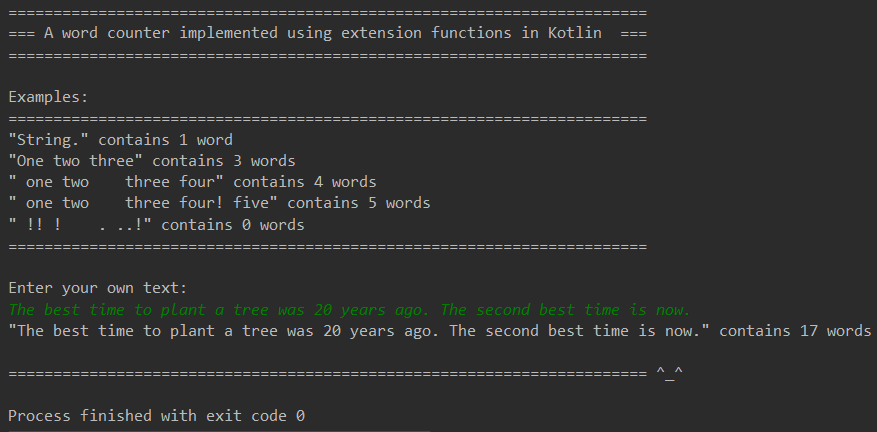

# Kotlin
## Extension Functions

An [extension function](https://kotlinlang.org/docs/reference/extensions.html) is useful when you wish to extend the functionality of an existing class without having to write a new class.  
Common use cases usually include some sort of utility, ie. the StringUtils class is a good candidate to replace with extension functions.

### Example

This example shows 3 extension functions to count the number of words in a String separated by a space.  Another extension function
will check if the given string is in fact a word.  The final extension function converts a String to its plural form based on a counter.

#### Code
```kotlin
/**
 * String extension to count the number of words separated by a space.
 */
fun String.wordCount(): Int {
    return this.split(" ").filter { it.isWord() }.size
}

/**
 * String extension function to check if the given string is a word.
 *
 * A word is any String which contains at least on Letter or Number.
 *
 * <example>
 *   "Tree" is a word
 *   "20" is a word
 *   "!!!" is not a word
 *   " " is not a word
 * </example>
 */
fun String.isWord(): Boolean {
    val filter = this.filter { it in 'A'..'Z' || it in 'a'..'z' || it in '0'..'9' }
    return !filter.isBlank()
}

/**
 * A String extension function to convert a given String to its plural form.
 *
 * <example>
 *   "word".plural(0) -> "words"
 *   "word".plural(1) -> "word"
 *   "word".plural(2) -> "words"
 *   "dress".plural(2) -> "dresses"
 * </example>
 */
fun String.plural(count: Int): String {
    return if (count != 1) {
        return if (this.endsWith('s') ||
                this.endsWith('x') ||
                this.endsWith("ch") ||
                this.endsWith("sh")) {
            "${this}es"
        } else {
            "${this}s"
        }
    } else {
        this
    }
}

/**
 * Usage example
 */
fun main(args: Array<String>) {
    println("=======================================================================")
    println("=== A word counter implemented using extension functions in Kotlin  ===")
    println("=======================================================================\n")
    println("Examples:")
    println("=======================================================================")
    var testString = "String."
    printWordCount(testString)

    testString = "One two three"
    printWordCount(testString)

    testString = " one two  three four"
    printWordCount(testString)

    testString = " one two    three four! five"
    printWordCount(testString)

    testString = " !! !    . ..!"
    printWordCount(testString)

    println("=======================================================================")
    print("\nEnter your own text:\n")
    testString = readLine()!!
    printWordCount(testString)

    println("\n======================================================================= ^_^")
}
```

#### Screenshots

